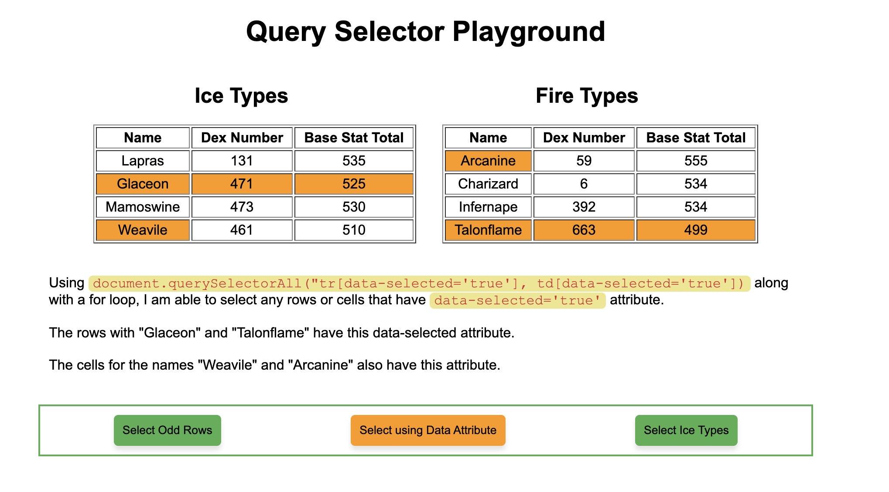

# Query Selector Playground

I am practicing my query selector knowledge by creating a little app that shows selecting different pieces of a table using buttons.

When you click on a button, it will highlight certain parts of certain tables. A brief description of the query selector used and any additional code will be shown to explain what is going on.

You can check out a live version of this project hosted on GitHub Pages [here](https://rperry99.github.io/Query-selector-playground/)

## Functionality

- You can select all the odd number rows in both tables.
- You can select specific rows or cells, that have pre-determined attributes.
  - The "Glaceon" and "Talonflame" rows have this data attribute.
  - The cells "Weavile" and "Arcanine" have this data attribute.
- You can select only the ice type Pokemon while not selecting the header row.